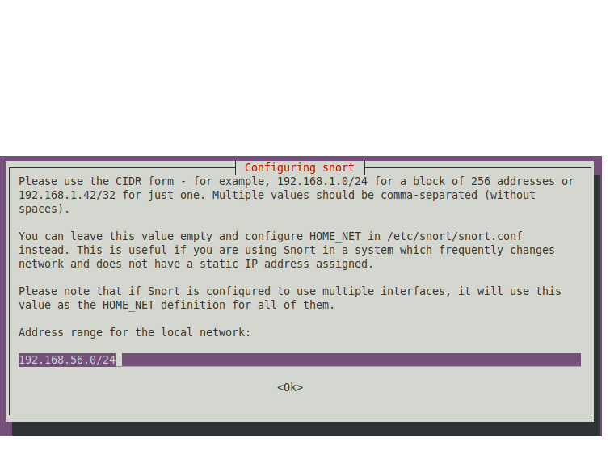
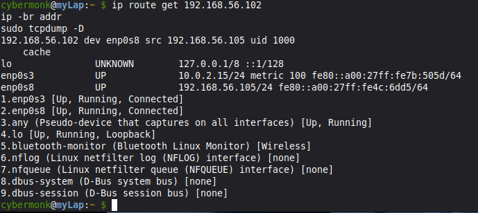
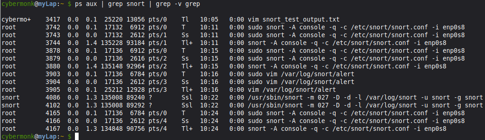
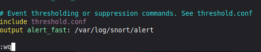
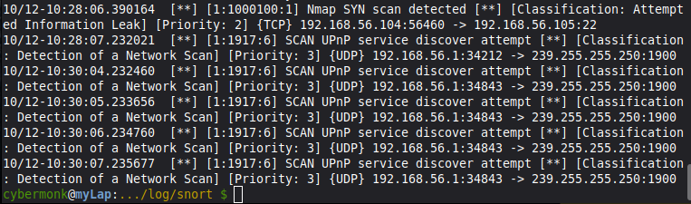
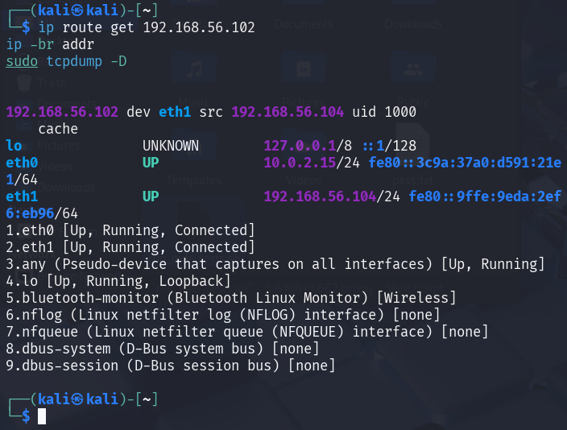

> [<u>**Project 1: NIDS Rule Creation and Testing Lab**
> ♂️</u>](https://tinyurl.com/waf7tw7d)

**Network** **Intrusion** **Detection** **System** **(NIDS)** **Rule**
**Creation** **and** **Testing** **Lab**

**Problem Statement**:Develop and test a robust set of custom rules
for a Network Intrusion Detection System (NIDS) to identify and flag
common cyber-attacks in real-time, reducing the mean time to detect
threats within a network.

**Abstract**

A concise summary of what you built: a virtualised lab, Snort NIDS on
Ubuntu, a Kali attacker, and a custom rule to detect brute-force
attempts.

**Use Case**:Create a virtualized security lab where an open-source
NIDS like Snort or Suricata is deployed to monitor network traffic. The
system will be configured with custom rules designed to detect specific
malicious activities, such as reconnaissance scans, brute-force login
attempts, and known malware communication, providing immediate alerts to
security analysts for investigation.

**Tools** **&** **Technologies** **Used:** 

• NIDS Engine: Snort,

• Operating System: Kali Linux 2025 (Attacker Machine), Ubuntu Server
24.04.10 (Target Machine)

• Virtualization: VirtualBox

• Attack & Testing Tools: Hydra

• Scripting & Analysis: Bash, Wireshark

This guide details how to set up Snort, a Network Intrusion Detection
System (NIDS), to detect an SSH brute-force attack.

> **Step** **1:** **Setup** **and** **Installation**

a\. **Install** **Ubuntu** **Server**:Use VirtualBox or VMware to create
a new virtual machine. Install a minimal Ubuntu Server. Ensure the
network adapter is set to "Bridged Mode" to get an IP address from your
local network.

b\. **Install** **Snort**:Once the VM is running, update your package
list and install Snort.

>  style="width:4.92278in;height:3.76736in" />
cybermonk@myLap:~
> \$sudo *apt* *update*
> cybermonk@myLap:~\$sudo *apt*
> *install* *snort* *-y*

**c.** **Configure** **Network** **Interface**: During installation,
you'll be prompted for the network interface to monitor. Enter the name
of your primary interface (e.g., eth0 or enp0s3). You can find it by
running the ip command. Also, provide your local network range in CIDR
notation (e.g., 192.168.56.0/24).

> **Step** **2:** **Create** **a** **Custom** **NIDS** **Rule**

a\. **Open** **the** **Rules** **File**:Snort's custom rules can be
placed in /etc/snort/rules/local.rules. Open this file with a text
editor like vim.

Note:

> Below is a ready-to-paste ***local.rules*** file (Snort) **and** a set
> of test commands / scripts to generate traffic that should trigger
> each rule. Copy ***local.rules*** into
> ***/etc/snort/rules/local.rules*** (or your Suricata **local.rules**
> equivalent after minor syntax checks). All SIDs use ***\>=***
> ***1000000***.
>
> **cybermonk@myLap:~\$** *sudo* *vim*
> [*<u>/etc/snort/rules/local.rules</u>*](https://tinyurl.com/yc3y3899)

Validate Snort config:

**cybermonk@myLap:~\$** *sudo* *snort* *-T* *-c*
*/etc/snort/snort.conf*

**Save** **the** **file** **to** **.txt** **file**

> **cybermonk@myLap:~\$** *sudo* *snort* *-T* *-c*
> */etc/snort/snort.conf* *\>*
> */home/cybermonk*[*<u>/snort_test_output.txt</u>*](https://tinyurl.com/ywzhv7mm)
> *2\>&1*

**Step** **3:** **Test** **the** **Rule**

> cybermonk@myLap:~\$*ip* *route* *get* *192.168.56.102* *ip*
> *-br* *addr*
>
> *sudo* *tcpdump* *-D*

This command:

> **cybermonk@myLap:~\$** *ps* *aux* *\|* *grep* *snort* *\|* *grep*
> *-v* *grep*

is used to **find** **all** **running** **processes** **related** **to**
**Snort**.

Show the active ***local.rules*** on the target (verify the rules exist
and SIDs):

> **cybermonk@myLap:~\$** *nl* *-ba* */etc/snort/rules/local.rules*
> *\|* *sed* *-n* *'1,200p'*

**Note:**

> Make sure the rules we created are present (SIDs 1000002, 1000100,
> etc.) and that there are no ***alert*** ***http*** headers left.

**b.** **Check** **Snort** **logs** **(if** **Snort** **is** **running**
**as** **a** **daemon):**

> **cybermonk@myLap:~\$** *sudo* *ls* *-l* */var/log/snort*
>
> *sudo* *tail* *-n* *200* */var/log/snort/alert* *\|\|* *sudo* *tail*
> *-n* *200* */var/log/snort/fast.log* *\|\|* *true*
>
> total 740
>
> -rw-r--r-- 1 root adm
>
> -rw------- 1 root adm
>
> -rw------- 1 root adm

0 Oct 12 05:33 snort.alert.fast

> 0 Oct 12 06:09 snort.log.1760249370
>
> 0 Oct 12 06:14 snort.log.1760249657
>
> -rw------- 1 root adm 376618 Oct 12 06:56 snort.log.1760251584
>
> -rw------- 1 root adm 378458 Oct 12 08:50 snort.log.1760258824
>
> tail: cannot open '/var/log/snort/alert' for reading: No such file or
> directory
>
> tail: cannot open '/var/log/snort/fast.log' for reading: No such file
> or directory

***cybermonk@myLap:~\$***

If the directory is empty or no alert file, Snort may not be logging or
running.

**Note:**

> Thanks here— the missing
> [***<u>/var/log/snort/alert</u>***](https://tinyurl.com/3bdckkza)
> tells us Snort isn’t writing alerts to that file (either it’s logging
> elsewhere, running only in the console, or the log
> directory/permissions aren’t correct). Let’s fix and verify
> **quickly**.

**C.** **Creating** **snort** **alert** **directory**

**Kill** **all** **extra** **Snort** **processes**

> **cybermonk@myLap:~\$** *sudo* *pkill* *snort*

**Daemon** **mode** **with** **alert** **logging** **(for**
**persistent** **logging):**

> Edit ***/etc/snort/snort.conf*** to add:

> output alert_fast: /var/log/snort/alert

Make sure ***/var/log/snort*** exists and is owned by **snort:**
**cybermonk@myLap:~\$** *sudo* *mkdir* *-p* */var/log/snort* *sudo*
*chown* *snort:snort* */var/log/snort*

> *sudo* *chmod* *750* */var/log/snort*
>
> **cybermonk@myLap:~\$**

Now, alerts will be logged to **/var/log/snort/alert.**

Note: *sudo* *tail* *-n* *200* */var/log/snort/alert* *\|\|* *sudo*
*tail* *-n* *200* */var/log/snort/fast.log* *\|\|* *true*

**d.Start** **Snort** **in** **console** **(live)** **and** **capture**
**verbose** **errors**— run this in a terminal and leave it open:

> *sudo* *snort* *-A* *console* *-q* *-c* */etc/snort/snort.conf* *-i*
> *\<interface\>* Replace **\<interface\>** with your actual interface
> (**i*p*** ***a*** to check).

Replace **eth0** with your actual interface (**i*p*** ***a*** to check).

Leave this terminal open — alerts will appear live.

**Step** **4.** **Perform** **the** **Attack** **(Kali** **Machine):**

a\. Script (save on attacker VM as
[**<u>run_nids_tests.sh</u>**](https://tinyurl.com/yat2p87x))

On your **attacker** **(Kali)** machine run the following commands to
make the correct script, make it executable, and run it. (This writes a
single file
[<u>/***home/kali/run_nids_tests.sh.***</u>](https://tinyurl.com/yat2p87x))

This will create
[***<u>/home/kali/run_nids_tests.sh</u>***](https://tinyurl.com/yat2p87x)
with the full content and make it executable.

**b.** **Check** **the** **file** **:** **──(kali**㉿**kali)-\[~\]**

**└─\$** *ls* *-l* *./run_nids_tests.sh*

***-rwxrwxr-x*** ***1*** ***kali*** ***kali*** ***3662*** ***Oct***
***12*** ***02:56*** ***./run_nids_tests.sh***
**┌──(kali**㉿**kali)-\[~\]**

**└─\$** *chmod* *+x* *run_nids_tests.sh*

**┌──(kali**㉿**kali)-\[~\]**

**└─\$** *ip* *route* *get* *192.168.56.102* *ip* *-br* *addr*

*sudo* *tcpdump* *-D*

**c.** **Perform** **the** **Attack** **┌──(kali**㉿**kali)-\[~\]**

**└─\$** *sudo* *bash* *-x* */home/kali/run_nids_tests.sh*
*192.168.56.105* *eth1*

If ip could not auto-detect the interface you can provide it as second
argument:

> *sudo* *./run_nids_tests.sh* *192.168.56.102* *eth0*

**d.Verify** **the** **Alert** **(in** **NIDs** **machine):**

**e.** **In** **Target**

Check alerts (console or log):

**cybermonk@myLap:~** **\$** *sudo* *tail* *-n* *50*
*/var/log/snort/alert*

**\#** **Or** **watch** **live**

**cybermonk@myLap:~** **\$** *sudo* *tail* *-f* */var/log/snort/alert*

**Or**

**cybermonk@myLap:~** **\$** *sudo* *journalctl* *-u* *snort*
*--no-pager* *-n* *200* *\|\|* *sudo* *grep* *-i* *snort*
*/var/log/syslog* *\|\|* *true*

                              Copyright@2025-Sandip Biswa (Employee ID: 1d0c5d2cb425) 

