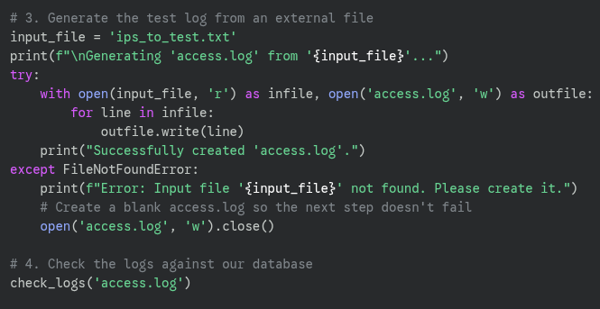
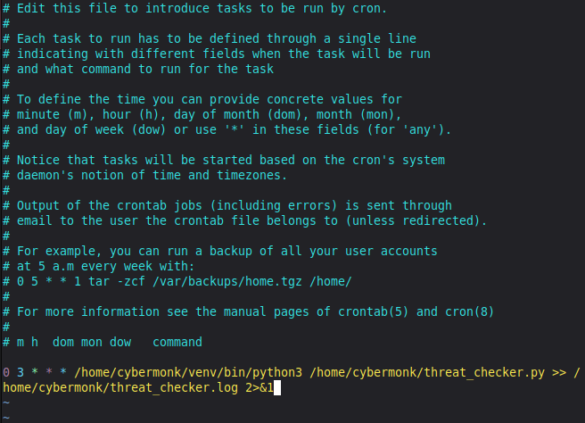

> [<u>**Project 3: Threat Intel Processor**
> ♂️</u>](https://tinyurl.com/waf7tw7d)

This guide explains how to build a Python script that fetches malicious
IPs from the **AbuseIPDB** threat feed and checks them against a sample
log file.

**Key** **Modules:**

• Threat Intelligence Feed Aggregator (API Clients) • IOC Storage (Local
Database)

• Log Processing & Correlation Engine

• Anomaly Detection & Alerting Mechanism • Simulated Log Generator

**Step** **1:** **Set** **up** **an** **API** **key**

> a\. Install Python and Libraries:
>
> **cybermonk@myLap:~** **\$** *sudo* *apt* *update* *&&* *sudo* *apt*
> *upgrade* *-y* **cybermonk@myLap:~** **\$** *sudo* *apt* *install*
> *-y* *python3* *python3-pip*
>
> **cybermonk@myLap:~** **\$** *source* *venv/bin/activate*
>
> **cybermonk@myLap:~** **\$** *pip* *install* *requests*

> b\. Get an AbuseIPDB API key: (Steps in
> [**<u>Annexure-1</u>**](https://tinyurl.com/36w7td5n))
>
> Go to [<u>https://www.abuseipdb.com/</u>](https://www.abuseipdb.com/)
> and create a free account.
>
> Navigate to your account section and go to "API".
>
> Create an API key and copy it

**Step** **2:** **Create** **the** **Python** **script**

> Create a single Python file name<u>d</u>
> ***<u>[threat_checker.py](https://tinyurl.com/ymks6863).</u>***
>
> **cybermonk@myLap:~** **\$** *vim*
> [*<u>threat_checker.py</u>*](https://tinyurl.com/ymks6863)
>
> **Key:**
> f79817039c21acb71de0e5f3df54a89361ec797c5c400542b81cd1312d3ced3558b05d61b2802463

**The** **Strategy:** **Use** **a** **Separate** **Input** **File** 📝

We'll create a new file, for example,
[<u>ips_to_test.txt.</u>](https://tinyurl.com/4ybkb38k) Your Python
script will be changed to read every line from this file and use it to
build the access.log for testing.

> **How** **It** **Works** **Now** ✅

Your workflow is now much simpler:

> a\. To add, remove, or change the IPs you want to test, you only need
> to edit the
> [***<u>ips_to_test.txt</u>***](https://tinyurl.com/4ybkb38k)
> ips_to_test.txt file.
>
> b\. You never need to touch the threat_checker.py script again for
> this purpose.
>
> c\. Just run the script as usual (***python3***
> <u>[*threat_checker.py*](https://tinyurl.com/ymks6863))</u>, and it
> will automatically use the latest list of IPs from your input file for
> the scan.

**Step** **3:** **Run** **and** **Verify**

> a\. Run the script:
>
> **cybermonk@myLap:~** **\$** *python3* *threat_checker.py*

> b\. **Analyze** **the** **Output:** The script will first print that
> it's fetching data and updating the database. Then, it will scan the
> access.log file it created. Since the threat feed is live, the exact
> malicious IPs will change, but you should see at least one "**ALERT**"
> message if any of the IPs in your access.log happen to be on the
> current AbuseIPDB blacklist.

**Step** **4:** **Create** **the** **Cron** **Job:**

Now we'll add the scheduled task to your user's "crontab" file.

> a\. **Open** **the** **crontab** **editor**:
>
> **cybermonk@myLap:~** **\$** *crontab* *-e*
>
> If it's your first time, it might ask you to choose a text editor.
> ***nano*** is usually the easiest option.
>
> b\. **Add** **the** **cron** **job** **line**: Go to the bottom of the
> file and add the following line. This example will run the script
> every day at 3:00 AM
>
> 0 3 \* \* \* /home/cybermonk/venv/bin/python3
> /home/cybermonk/threat_checker.py \>\>
> /home/cybermonk/threat_checker.log 2\>&1

> **c.** **Save** **and** **Exit:**
>
> In **nano,** press ***Ctrl*** ***+*** ***X,*** then ***Y*** to
> confirm, and ***Enter*** to save. You should see a message like
> crontab: *installing* *new* *crontab.*

                              Copyright@2025-Sandip Biswa (Employee ID: 1d0c5d2cb425) 

