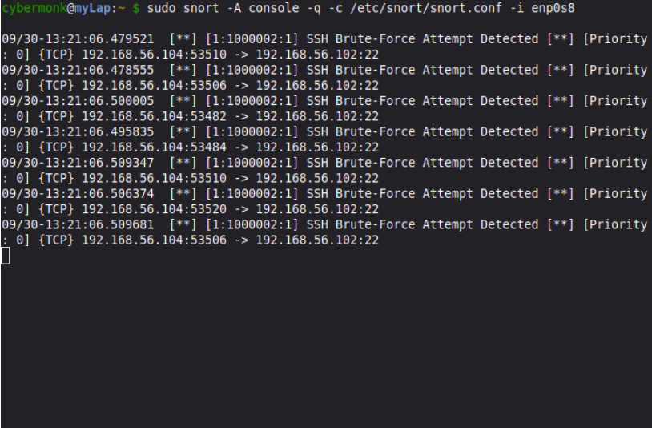
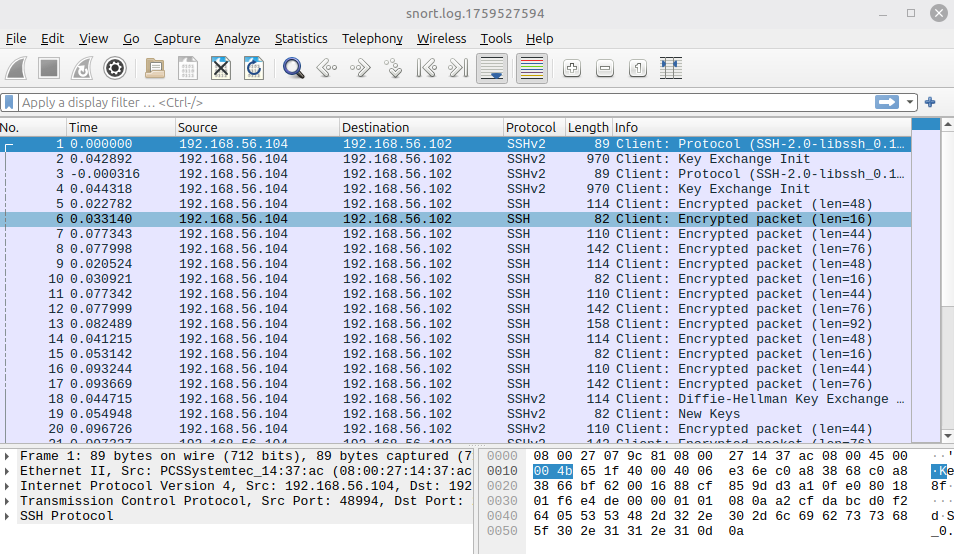

# NIDS Rule Creation and Testing Lab using Snort

[cite_start]This project demonstrates the setup of a virtualized lab to develop and test custom rules for a Network Intrusion Detection System (NIDS)[cite: 3]. [cite_start]The goal is to identify and flag a common SSH brute-force attack in real-time[cite: 3, 7]. [cite_start]The lab consists of an Ubuntu Server running Snort as the target machine and a Kali Linux virtual machine as the attacker[cite: 5, 10].

## Table of Contents
- [Problem Statement](#problem-statement)
- [Lab Architecture](#lab-architecture)
- [Tools & Technologies](#tools--technologies)
- [Setup and Configuration](#setup-and-configuration)
  - [Step 1: Environment Setup](#step-1-environment-setup)
  - [Step 2: Install and Configure Snort](#step-2-install-and-configure-snort)
  - [Step 3: Create a Custom NIDS Rule](#step-3-create-a-custom-nids-rule)
- [Execution and Testing](#execution-and-testing)
  - [Step 4: Start Snort and SSH Server](#step-4-start-snort-and-ssh-server)
  - [Step 5: Perform the Attack](#step-5-perform-the-attack)
- [Results and Analysis](#results-and-analysis)
  - [Snort Alerts](#snort-alerts)
  - [Log Analysis](#log-analysis)

## Problem Statement

[cite_start]To develop and test a robust set of custom rules for a Network Intrusion Detection System (NIDS) to identify and flag common cyber-attacks in real-time, reducing the mean time to detect threats within a network[cite: 3].

## Lab Architecture

[cite_start]A virtualized security lab was created using VirtualBox[cite: 6, 11]. The environment includes:
* [cite_start]**Target Machine**: An Ubuntu Server 24.04.10 VM with Snort installed to monitor network traffic[cite: 10, 15].
* [cite_start]**Attacker Machine**: A Kali Linux 2025 VM used to launch a simulated SSH brute-force attack[cite: 10, 18].

## Tools & Technologies

| Category          | Tool/Technology                                        |
| ----------------- | ------------------------------------------------------ |
| **NIDS Engine** | [cite_start]Snort [cite: 9]                                                |
| **Virtualization** | [cite_start]VirtualBox [cite: 11]                                          |
| **Operating Systems** | [cite_start]Ubuntu Server 24.04.10 (Target), Kali Linux 2025 (Attacker) [cite: 10] |
| **Attack Tool** | [cite_start]Hydra [cite: 12]                                               |
| **Analysis Tools** | [cite_start]Bash, Wireshark [cite: 13]                                     |

## Setup and Configuration

### Step 1: Environment Setup

1.  [cite_start]Create a new virtual machine and perform a minimal installation of Ubuntu Server[cite: 23].
2.  [cite_start]In the VM settings, ensure the network adapter is set to **Bridged Mode** to allow it to get an IP address from the local network[cite: 24].

### Step 2: Install and Configure Snort

1.  [cite_start]On the Ubuntu Server VM, update the package list and install Snort[cite: 25]:
    ```bash
    sudo apt update
    sudo apt install -y snort
    ```
    [cite_start][cite: 26, 27]
2.  [cite_start]During the installation, you will be prompted to enter the network interface to monitor (e.g., `enp0s3`) and your local network range in CIDR notation (e.g., `192.168.0.0/24`)[cite: 28, 29, 31, 40].

### Step 3: Create a Custom NIDS Rule

1.  [cite_start]Open the local rules file for Snort using a text editor[cite: 45, 46]:
    ```bash
    sudo vim /etc/snort/rules/local.rules
    ```
    [cite_start][cite: 47]
2.  Add the following rule to the end of the file. [cite_start]This rule is designed to detect an SSH brute-force attempt by tracking connection attempts to port 22[cite: 48]. [cite_start]It will trigger an alert if it detects more than 5 connection attempts from the same source IP within 60 seconds[cite: 49].

    ```makefile
    alert tcp any any -> $HOME_NET 22 (msg:"SSH Brute-Force Attempt Detected"; flow:to_server, established; detection_filter:track by_src, count 5, seconds 60; sid: 1000002; rev:1;)
    ```
    [cite_start][cite: 50]

## Execution and Testing

### Step 4: Start Snort and SSH Server

1.  [cite_start]On the Ubuntu VM, install an SSH server to act as the target for the attack[cite: 87]:
    ```bash
    sudo apt install -y openssh-server
    ```
    [cite_start][cite: 89]
2.  Start Snort in console mode to monitor alerts in real-time. [cite_start]Replace `enp0s8` with your actual network interface name[cite: 64, 65].
    ```bash
    sudo snort -A console -q -c /etc/snort/snort.conf -i enp0s8
    ```
    [cite_start][cite: 86]

### Step 5: Perform the Attack

1.  [cite_start]On the Kali Linux (attacker) VM, create a small password list file[cite: 98, 99]:
    ```bash
    echo "password123\nadmin\nroot\n123456\nqwerty" > pass.txt
    ```
    [cite_start][cite: 100]
2.  [cite_start]Use **Hydra** to launch the brute-force attack against the Ubuntu VM's IP address[cite: 97, 113]. [cite_start]Replace `<VM_IP>` with the target's IP (e.g., `192.168.56.102`)[cite: 116].
    ```bash
    hydra -l non_existent_user -P pass.txt ssh://<VM_IP>
    ```
    [cite_start][cite: 115]


## Results and Analysis

### Snort Alerts

[cite_start]While the Hydra attack is running, the Snort console on the Ubuntu VM will display multiple alerts, confirming that the custom rule has successfully detected the brute-force attempt[cite: 132, 133].

```
09/30-13:21:06.479521 [**] [1:1000002:1] SSH Brute-Force Attempt Detected [**] [Priority: 0] {TCP} 192.168.56.104:53510 -> 192.168.56.102:22
09/30-13:21:06.478555 [**] [1:1000002:1] SSH Brute-Force Attempt Detected [**] [Priority: 0] {TCP} 192.168.56.104:53506 -> 192.168.56.102:22
...
```
[cite_start][cite: 137, 138, 139, 140]



### Log Analysis

[cite_start]Snort logs all activity in the `/var/log/snort` directory[cite: 17]. [cite_start]The log files are in a binary format and can be converted to a human-readable format for analysis[cite: 198].

1.  [cite_start]**Convert Log File**: Use the following command to convert the binary log file (e.g., `snort.log.1759527594`) into a plain text file[cite: 198, 199]:
    ```bash
    sudo snort -r /var/log/snort/snort.log.1759527594 &> ~/snort-log.txt
    ```
2.  [cite_start]**Packet Analysis with Wireshark**: The binary log files can also be opened directly in Wireshark for detailed packet-level analysis of the attack traffic[cite: 200].


