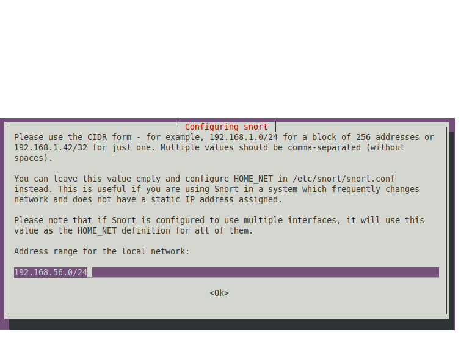
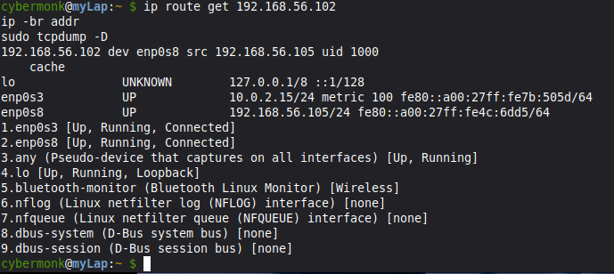
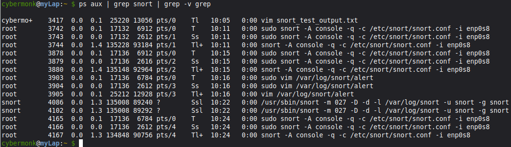
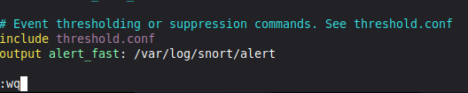
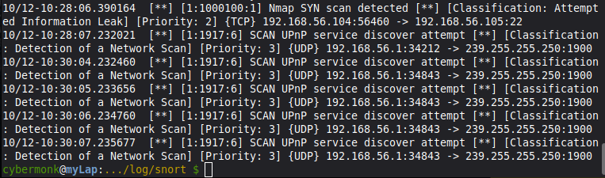
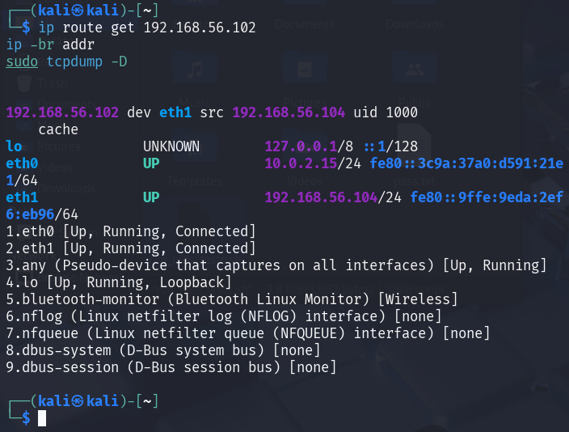

> [<u>**Project 1: NIDS Rule Creation and Testing Lab**
> ♂️</u>](https://tinyurl.com/t3v5x8t3)

**Network** **Intrusion** **Detection** **System** **(NIDS)** **Rule**
**Creation** **and** **Testing** **Lab**

**Problem** **Statement:**Develop and test a robust set of custom rules
for a Network Intrusion Detection System (NIDS) to identify and flag
common cyber-attacks in real-time, reducing the mean time to detect
threats within a network.

**Abstract**

A concise summary of what you built: a virtualised lab, Snort NIDS on
Ubuntu, a Kali attacker, and a custom rule to detect brute-force
attempts.

**Use** **Case:**Create a virtualized security lab where an open-source
NIDS like Snort or Suricata is deployed to monitor network traffic. The
system will be configured with custom rules designed to detect specific
malicious activities, such as reconnaissance scans, brute-force login
attempts, and known malware communication, providing immediate alerts to
security analysts for investigation.

**Tools** **&** **Technologies** **Used:** • NIDS Engine: Snort,

Sandip Biswa (Employee ID: 1d0c5d2cb425) page 1

• Operating System: Kali Linux 2025 (Attacker Machine), Ubuntu Server
24.04.10 (Target Machine)

• Virtualization: VirtualBox

• Attack & Testing Tools: Hydra

• Scripting & Analysis: Bash, Wireshark

Focus Directory is

> 1\. Target Machine (Ubuntu Server)
>
> **cybermonk@myLap:~** **\$** [*<u>cd
> /etc/snort/rules/local.rules</u>*](https://tinyurl.com/bvdzd7bd)
>
> 2\. Attacker Machine

This guide details how to set up Snort, a Network Intrusion Detection
System (NIDS), to detect an SSH brute-force attack.

> **Step** **1:** **Setup** **and** **Installation**

Sandip Biswa (Employee ID: 1d0c5d2cb425) page 2

a\. **Install** **Ubuntu** **Server:**Use VirtualBox or VMware to create
a new virtual machine. Install a minimal Ubuntu Server. Ensure the
network adapter is set to "Bridged Mode" to get an IP address from your
local network.

b\. **Install** **Snor**t:Once the VM is running, update your package
list and install Snort.

>  style="width:4.92278in;height:3.76736in" />**cybermonk@myLap:~**
> **\$***sudo* *apt* *update* **cybermonk@myLap:~** **\$***sudo* *apt*
> *install* *snort* *-y*

**c.** **Configure** **Network** **Interface**: During installation,
you'll be prompted for the network interface to monitor. Enter the name
of your primary interface (e.g., eth0 or enp0s3). You can find it by
running the ip command. Also, provide your local network range in CIDR
notation (e.g., 192.168.56.0/24).

> **Step** **2:** **Create** **a** **Custom** **NIDS** **Rule**

a\. **Open** **the** **Rules** **File**:Snort's custom rules can be
placed in /etc/snort/rules/local.rules. Open this file with a text
editor like nano.

Note:

> Below is a ready-to-paste ***local.rules*** file (Snort) **and** a set
> of test commands / scripts to generate traffic that should trigger
> each rule. Copy ***local.rules*** into
> ***/etc/snort/rules/local.rules*** (or your Suricata **local.rules**
> equivalent after minor syntax checks). All SIDs use ***\>=***
> ***1000000***.
>
> **cybermonk@myLap:~** **\$***sudo* *vim*
> [*<u>/etc/snort/rules/local.rules</u>*](https://tinyurl.com/bvdzd7bd)

\# local.rules - Custom Snort rules (lab)

\# Place this file at /etc/snort/rules/local.rules

Sandip Biswa (Employee ID: 1d0c5d2cb425) page 3

\# All SIDs \>= 1000000 (local rules)

\########################################################################
\# SSH brute-force (alert)

\# Triggers after 5 or more established SSH connection attempts from
same src within 60s
\########################################################################
alert tcp any any -\> \$HOME_NET 22 (msg:"SSH Brute-Force Attempt
Detected";

flow:to_server,established; detection_filter:track by_src, count 5,
seconds 60; classtype:attempted-admin; priority:1; sid:1000002; rev:2;)

\# Optional IPS (drop) version - ONLY enable if Snort is running
inline/IPS

\# drop tcp any any -\> \$HOME_NET 22 (msg:"SSH Brute-Force Attempt -
Block"; flow:to_server,established; detection_filter:track by_src, count
5, seconds 60; classtype:attempted-admin; priority:1; sid:1000003;
rev:1;)

\########################################################################
\# FTP brute-force (alert)

\# Triggers after 10 or more established FTP connection attempts from
same src within 60s
\########################################################################
alert tcp any any -\> \$HOME_NET 21 (msg:"FTP Brute-Force Attempt
Detected"; flow:to_server,established; detection_filter:track by_src,
count 10, seconds 60; classtype:attempted-admin; priority:1;
sid:1000200; rev:1;)

\########################################################################
\# Nmap scan detection (SYN / FIN / XMAS)

\# Tune count/seconds for your environment to reduce false positives.
\########################################################################

\# Nmap SYN scan (many SYNs to many ports)

alert tcp any any -\> \$HOME_NET any (msg:"Nmap SYN scan detected";
flags:S; detection_filter:track by_src, count 20, seconds 60;
classtype:attempted-recon; priority:2; sid:1000100; rev:1;)

\# Nmap FIN scan

alert tcp any any -\> \$HOME_NET any (msg:"Nmap FIN scan detected";
flags:F; detection_filter:track by_src, count 20, seconds 60;
classtype:attempted-recon; priority:2; sid:1000101; rev:1;)

\# Nmap XMAS scan (FIN,PSH,URG)

alert tcp any any -\> \$HOME_NET any (msg:"Nmap XMAS scan detected";
flags:FPU; detection_filter:track by_src, count 20, seconds 60;
classtype:attempted-recon; priority:2; sid:1000102; rev:1;)

\########################################################################
\# Simple HTTP C2 beacon signature (example)

\# Matches repeated GETs for /update.php to web ports (80,8080). Adjust
URI & ports for your lab.

Sandip Biswa (Employee ID: 1d0c5d2cb425) page 4

\# Uses uricontent so rule header uses TCP (required by Snort).
\########################################################################

alert tcp any any -\> \$HOME_NET 80,8080 (msg:"Possible C2 Beacon -
suspicious URI /update.php"; flow:to_server,established;
uricontent:"/update.php"; nocase; detection_filter:track by_src, count
5, seconds 300; classtype:trojan-activity; priority:2; sid:1000300;
rev:2;)

\# If you want to monitor any TCP destination (less strict), use this
variant instead:

\# alert tcp any any -\> \$HOME_NET any (msg:"Possible C2 Beacon -
suspicious URI /update.php"; flow:to_server,established;
uricontent:"/update.php"; nocase; detection_filter:track by_src, count
5, seconds 300; classtype:trojan-activity; priority:2; sid:1000301;
rev:1;)

\########################################################################
\# End of local.rules
\########################################################################
Validate Snort config:

**cybermonk@myLap:~** **\$** *sudo* *snort* *-T* *-c*
*/etc/snort/snort.conf*

**Save** **the** **file** **to** **.txt** **file**

> **cybermonk@myLap:~** **\$** *sudo* *snort* *-T* *-c*
> */etc/snort/snort.conf* *\>*
> */home/cybermonk*[*<u>/snort_test_output.txt</u>*](https://tinyurl.com/p8vdvpsp)
> *2\>&1*

**Step** **3:** **Test** **the** **Rule**

> **cybermonk@myLap:~** **\$***ip* *route* *get* *192.168.56.102* *ip*
> *-br* *addr*
>
> *sudo* *tcpdump* *-D*

Sandip Biswa (Employee ID: 1d0c5d2cb425) page 5

This command:

> **cybermonk@myLap:~** **\$***ps* *aux* *\|* *grep* *snort* *\|* *grep*
> *-v* *grep*

is used to **find** **all** **running** **processes** **related** **to**
**Snort**.

Show the active ***local.rules*** on the target (verify the rules exist
and SIDs):

> **cybermonk@myLap:~** **\$** *nl* *-ba* */etc/snort/rules/local.rules*
> *\|* *sed* *-n* *'1,200p'*

**Note:**

> Make sure the rules we created are present (SIDs 1000002, 1000100,
> etc.) and that there are no ***alert*** ***http*** headers left.

**b.** **Check** **Snort** **logs** **(if** **Snort** **is** **running**
**as** **a** **daemon):**

Sandip Biswa (Employee ID: 1d0c5d2cb425) page 6

> **cybermonk@myLap:~** **\$** *sudo* *ls* *-l* */var/log/snort*
>
> *sudo* *tail* *-n* *200* */var/log/snort/alert* *\|\|* *sudo* *tail*
> *-n* *200* */var/log/snort/fast.log* *\|\|* *true*
>
> total 740
>
> -rw-r--r-- 1 root adm
>
> -rw------- 1 root adm
>
> -rw------- 1 root adm

0 Oct 12 05:33 snort.alert.fast

> 0 Oct 12 06:09 snort.log.1760249370
>
> 0 Oct 12 06:14 snort.log.1760249657
>
> -rw------- 1 root adm 376618 Oct 12 06:56 snort.log.1760251584
>
> -rw------- 1 root adm 378458 Oct 12 08:50 snort.log.1760258824
>
> tail: cannot open '/var/log/snort/alert' for reading: No such file or
> directory
>
> tail: cannot open '/var/log/snort/fast.log' for reading: No such file
> or directory

***cybermonk@myLap:~*** ***\$***

If the directory is empty or no alert file, Snort may not be logging or
running.

**Note:**

> Thanks here— the missing
> [***<u>/var/log/snort/alert</u>***](https://tinyurl.com/4j28sj4u)
> tells us Snort isn’t writing alerts to that file (either it’s logging
> elsewhere, running only in the console, or the log
> directory/permissions aren’t correct). Let’s fix and verify
> **quickly**.

**C.** **Creating** **snort** **alert** **directory**

**Kill** **all** **extra** **Snort** **processes**

> **cybermonk@myLap:~** **\$** *sudo* *pkill* *snort*

**Daemon** **mode** **with** **alert** **logging** **(for**
**persistent** **logging):**

> Edit ***/etc/snort/snort.conf*** to add:

Sandip Biswa (Employee ID: 1d0c5d2cb425) page 7

> output alert_fast: /var/log/snort/alert

Make sure ***/var/log/snort*** exists and is owned by **snort:**
**cybermonk@myLap:~** **\$** *sudo* *mkdir* *-p* */var/log/snort* *sudo*
*chown* *snort:snort* */var/log/snort*

> *sudo* *chmod* *750* */var/log/snort*
>
> **cybermonk@myLap:~** **\$**

Now, alerts will be logged to **/var/log/snort/alert.**

Note: *sudo* *tail* *-n* *200* */var/log/snort/alert* *\|\|* *sudo*
*tail* *-n* *200* */var/log/snort/fast.log* *\|\|* *true*

**d.Start** **Snort** **in** **console** **(live)** **and** **capture**
**verbose** **errors**— run this in a terminal and leave it open:

> *sudo* *snort* *-A* *console* *-q* *-c* */etc/snort/snort.conf* *-i*
> *\<interface\>* Replace **\<interface\>** with your actual interface
> (**i*p*** ***a*** to check).

Replace **eth0** with your actual interface (**i*p*** ***a*** to check).

Leave this terminal open — alerts will appear live.

Sandip Biswa (Employee ID: 1d0c5d2cb425) page 8

**Step** **4.** **Perform** **the** **Attack** **(Kali** **Machine):**

a\. Script (save on attacker VM as
[**<u>run_nids_tests.sh</u>**](https://tinyurl.com/3s3bcb2r))

On your **attacker** **(Kali)** machine run the following commands to
make the correct script, make it executable, and run it. (This writes a
single file
[<u>/***home/kali/run_nids_tests.sh.***</u>](https://tinyurl.com/3s3bcb2r))

> \#!/usr/bin/env bash
>
> \# run_nids_tests.sh - Attacker-side NIDS test script
>
> \# Usage: sudo ./run_nids_tests.sh TARGET_IP \[IFACE\] \# Default
> TARGET_IP = 192.168.56.102
>
> set -u
>
> TARGET=\${1:-192.168.56.102}
>
> IFACE=\${2:-\$(ip route get "\$TARGET" 2\>/dev/null \| awk '/dev/
> {print \$5; exit}')}
>
> PCAP="/tmp/nids_test\_\${TARGET//./\_}.pcap"
> TCPDUMP_PID_FILE="/tmp/tcpdump_nids_test.pid"
>
> echo "\[\*\] Target: \$TARGET"
>
> if \[\[ -z "\$IFACE" \|\| "\$IFACE" == "0.0.0.0" \]\]; then
>
> echo "\[!\] Interface autodetect failed. List your interfaces with: ip
> -br addr" echo " Re-run the script with the interface as second
> argument, e.g.:" echo " sudo ./run_nids_tests.sh \$TARGET eth1"
>
> exit 2 fi
>
> echo "\[\*\] Interface: \$IFACE" echo "\[\*\] PCAP file: \$PCAP" echo
>
> \# require sudo
>
> if \[\[ \$EUID -ne 0 \]\]; then
>
> echo "\[!\] Please run with sudo. Exiting." exit 3
>
> fi
>
> \# Check for required commands and warn (we won't attempt to install)
> for cmd in tcpdump nmap curl ssh; do
>
> if ! command -v "\$cmd" \>/dev/null 2\>&1; then
>
> echo "\[!\] Warning: '\$cmd' not found. Some tests may be skipped." fi

Sandip Biswa (Employee ID: 1d0c5d2cb425) page 9

> done
>
> \# start tcpdump capturing traffic between attacker and target (if
> tcpdump exists) if command -v tcpdump \>/dev/null 2\>&1; then
>
> echo "\[\*\] Starting tcpdump..."
>
> tcpdump -i "\$IFACE" host "\$TARGET" -w "\$PCAP" 2\>/dev/null &
> TCPDUMP_PID=\$!
>
> echo \$TCPDUMP_PID \> "\$TCPDUMP_PID_FILE" sleep 1
>
> echo "\[\*\] tcpdump started (pid \$TCPDUMP_PID)." else
>
> echo "\[!\] tcpdump not installed — continuing without pcap capture."
> fi
>
> \# 1) Nmap tests (if nmap installed)
>
> if command -v nmap \>/dev/null 2\>&1; then echo
>
> echo "==== \[Nmap SYN scan\] ===="
>
> nmap -sS -Pn "\$TARGET" -oN /tmp/nmap_syn_scan\_\${TARGET}.txt \|\|
> true sleep 2
>
> echo
>
> echo "==== \[Nmap FIN scan\] ===="
>
> nmap -sF -Pn "\$TARGET" -oN /tmp/nmap_fin_scan\_\${TARGET}.txt \|\|
> true sleep 2
>
> echo
>
> echo "==== \[Nmap XMAS scan\] ===="
>
> nmap -sX -Pn "\$TARGET" -oN /tmp/nmap_xmas_scan\_\${TARGET}.txt \|\|
> true sleep 2
>
> else
>
> echo "\[!\] nmap not installed; skipping Nmap tests." fi
>
> \# 2) SSH brute-force (quick) - simple connect attempts if command -v
> ssh \>/dev/null 2\>&1; then
>
> echo
>
> echo "==== \[SSH brute attempts x6\] ====" for i in {1..6}; do
>
> ssh -o ConnectTimeout=2 -o StrictHostKeyChecking=no
> invaliduser@"\$TARGET" 2\>/dev/null \|\| true
>
> sleep 1 done sleep 2

Sandip Biswa (Employee ID: 1d0c5d2cb425) page 10

> else
>
> echo "\[!\] ssh client not installed; skipping SSH tests." fi
>
> \# 3) FTP attempts (simple TCP connects) - uses bash TCP socket,
> always available on modern bash
>
> echo
>
> echo "==== \[FTP connect attempts x12\] ====" for i in {1..12}; do
>
> timeout 3 bash -c "echo \> /dev/tcp/\$TARGET/21" 2\>/dev/null \|\|
> true sleep 1
>
> done sleep 2
>
> \# 4) HTTP beacon simulation - 5 quick GETs to /update.php if command
> -v curl \>/dev/null 2\>&1; then
>
> echo
>
> echo "==== \[HTTP beacon: GET /update.php x5\] ====" for i in {1..5};
> do
>
> curl -s -I "http://\$TARGET/update.php" \>/dev/null 2\>&1 \|\| true
> sleep 1
>
> done else
>
> echo "\[!\] curl not installed; skipping HTTP beacon." fi
>
> \# cleanup tcpdump
>
> if \[\[ -f "\$TCPDUMP_PID_FILE" \]\]; then
>
> TCPDUMP_PID=\$(cat "\$TCPDUMP_PID_FILE" 2\>/dev/null \|\| echo "") if
> \[\[ -n "\$TCPDUMP_PID" \]\]; then
>
> echo
>
> echo "\[\*\] Stopping tcpdump (pid \$TCPDUMP_PID)..." kill
> "\$TCPDUMP_PID" 2\>/dev/null \|\| true
>
> sleep 1 fi
>
> rm -f "\$TCPDUMP_PID_FILE" fi
>
> echo
>
> echo "\[\*\] Tests finished." if \[\[ -f "\$PCAP" \]\]; then
>
> echo "\[\*\] PCAP saved to: \$PCAP" else
>
> echo "\[!\] No PCAP was captured (tcpdump missing or failed)."

Sandip Biswa (Employee ID: 1d0c5d2cb425) page 11

> fi
>
> echo "\[\*\] Nmap outputs (if run): /tmp/nmap_syn_scan\_\${TARGET}.txt
> /tmp/nmap_fin_scan\_\${TARGET}.txt
> /tmp/nmap_xmas_scan\_\${TARGET}.txt" echo
>
> echo "On the TARGET (NIDS host) check alerts with:" echo " sudo tail
> -n 200 /var/log/snort/alert"
>
> Echo

This will create
[***<u>/home/kali/run_nids_tests.sh</u>***](https://tinyurl.com/3s3bcb2r)
with the full content and make it executable.

**b.** **Check** **the** **file** **:** **──(kali**㉿**kali)-\[~\]**

**└─\$** *ls* *-l* *./run_nids_tests.sh*

***-rwxrwxr-x*** ***1*** ***kali*** ***kali*** ***3662*** ***Oct***
***12*** ***02:56*** ***./run_nids_tests.sh***
**┌──(kali**㉿**kali)-\[~\]**

**└─\$** *chmod* *+x* *run_nids_tests.sh*

**┌──(kali**㉿**kali)-\[~\]**

**└─\$** *ip* *route* *get* *192.168.56.102* *ip* *-br* *addr*

*sudo* *tcpdump* *-D*

Sandip Biswa (Employee ID: 1d0c5d2cb425) page 12

**c.** **Perform** **the** **Attack** **┌──(kali**㉿**kali)-\[~\]**

**└─\$** *sudo* *bash* *-x* */home/kali/run_nids_tests.sh*
*192.168.56.105* *eth1*

If ip could not auto-detect the interface you can provide it as second
argument:

> *sudo* *./run_nids_tests.sh* *192.168.56.102* *eth0*

**d.Verify** **the** **Alert** **(in** **NIDs** **machine):**

**e.** **In** **Target**

Sandip Biswa (Employee ID: 1d0c5d2cb425) page 13

Check alerts (console or log):

**cybermonk@myLap:~** **\$** *sudo* *tail* *-n* *50*
*/var/log/snort/alert*

**\#** **Or** **watch** **live**

**cybermonk@myLap:~** **\$** *sudo* *tail* *-f* */var/log/snort/alert*

**Or**

**cybermonk@myLap:~** **\$** *sudo* *journalctl* *-u* *snort*
*--no-pager* *-n* *200* *\|\|* *sudo* *grep* *-i* *snort*
*/var/log/syslog* *\|\|* *true*

Sandip Biswa (Employee ID: 1d0c5d2cb425) page 14
